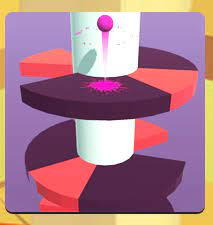
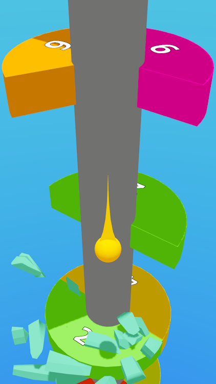
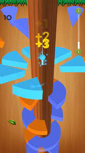
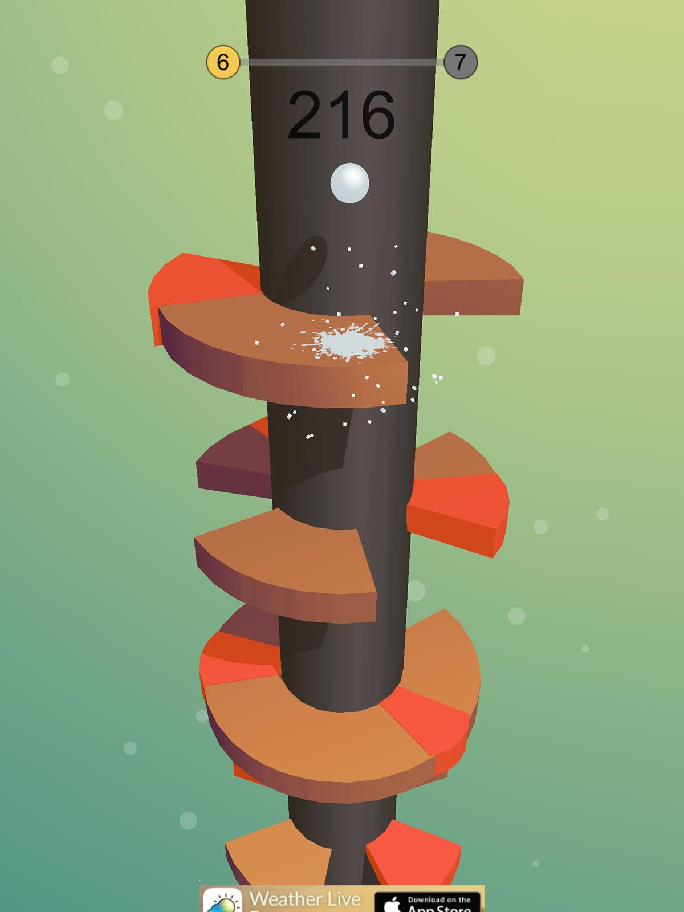

<head>
  

  
</head>
<body>
<h1 align="center">Helix Jump</h1>
  
<h3>Brief description of the game</h3>

Helix Jump is an arcade game with simple and addictively fun mechanics. In the   game,you guide a bouncing ball continuously down a series of circular platforms.Fall through the cracks and avoid landing in the forbidden zones!

<a href="https://www.crazygames.com/game/helix-jump" target="_blank">Click here to play the Game</a>

<h3>How to play the game</h3>
<h3>Step 1</h3>

It’s easy to follow the basic mechanics of Helix Jump. The key is mastering your reflexes and looking ahead.

<h3>Step 2</h3>

To guide the bouncing ball, rotate the platforms to align the ball with the cracks.

<h3>Step 3</h3>

Do this in quick succession for a combo move and higher points.

<h3>Step 4</h3>

If you go through 3 levels in quick succession, you're invincible for the first bounce after.

<h3> Project demo video </h3>
<video width="206" height="360" autoplay>
<source src="videoplayback.mp4" type="video/mp4">
</video>

</body>
</html> 

